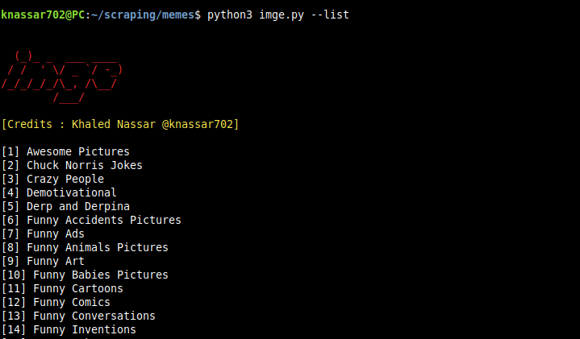

# imge
#### open source tool for downloading images from random websites



## requirements
* python 3.6
## install 
`$ python3 -m pip install -r requirements.txt`
## Support
* Linux
* Windows
* Mac
* Android

## Commands
```
python3 imge.py --list
```
for dump all lists

```
[1] Awesome Pictures
[2] Chuck Norris Jokes
[3] Crazy People
[4] Demotivational
[5] Derp and Derpina
[6] Funny Accidents Pictures
[7] Funny Ads
[8] Funny Animals Pictures
[9] Funny Art
[10] Funny Babies Pictures
[11] Funny Cartoons
[12] Funny Comics
[13] Funny Conversations
[14] Funny Inventions
[15] Funny Jokes
[16] Funny Kids
[17] Funny Me
[18] Funny Memes
[19] Funny Messages
[20] Funny Moments
[21] Funny People
[22] Funny Photoshop Fails
[23] Funny Photoshoppped Pictures
[24] Funny Pictures
[25] Funny Questions
[26] Funny Quotes
[27] Funny Sayings
[28] Funny Signs
[29] Funny Situations
[30] Funny Stories
[31] Funny Tattoos
[32] Funny Videos
[33] Funny Wallpapers
[34] Funny WTF Moments
[35] Girls Pictures
[36] Humor
[37] Life
[38] Like a Boss
[39] Optical illusions
[40] Quotes of The Day
[41] Romantic Pictures
```


### Start Downloading
#### `-n` and add the number of the list
```
$ python3 imge.py -n 12
```

## Add number of pages (scraping)
```
$ python3 imge.py -n 20 -p 200
```

## Add Threading
```
$ python3 imge.py -n 11 -t 30
```
## Dump all urls
#### dump without download
```
$ python3 imge.py -n 10 -t 20 --dump
```
#### dump with download
```
$ python3 imge.py -n 10 -t 20 --Dump
```
## Save all images in custom file
```
$ python3 imge.py -n 5 --file='images_file'
```

### use imge in your python project
```python
# imge path : /mypath/imge
# mypath : /mypath
from imge import lefunny,imgflip
lefunny = lefunny()
# dump the list
print(lefunny.dump_list())
for n,w in lefunny.dump_list().items():
	print(f'[{n}] {w[0]}')

# download

# lefunny.get(page,image_link)

lefunny.get(10,lefunny.dump_list()[12][1]) # download (number of page , link of list)

# download with dump all urls

lefunny.get(10,lefunny.dump_list()[12][1],Dump=True)

# Dumping without download 

lefunny.get(10,lefunny.dump_list()[12][1],dump=True)

#------------------

# Download from imgflip

imgflip.get_memes(10) # imgflip.get_memes(number of page)
# Download from imgflip and dump all urls

imgflip.get_memes(10,Dump=True)

# Dump all urls from imgflip without download

imgflip.get_memes(10,dump=True)

```
#### Scraping from : 
* https://lefunny.net
* https://imgflip.com
### Credits : Khaled Nassar <a href='mailto:knassar702@gmail.com'>@knassar702</a>
